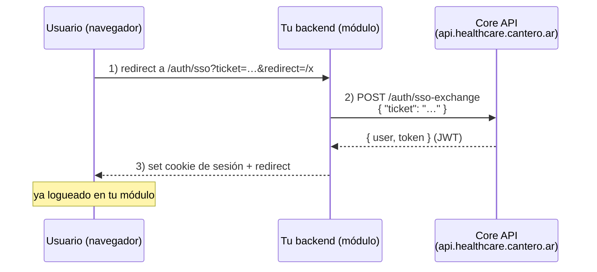
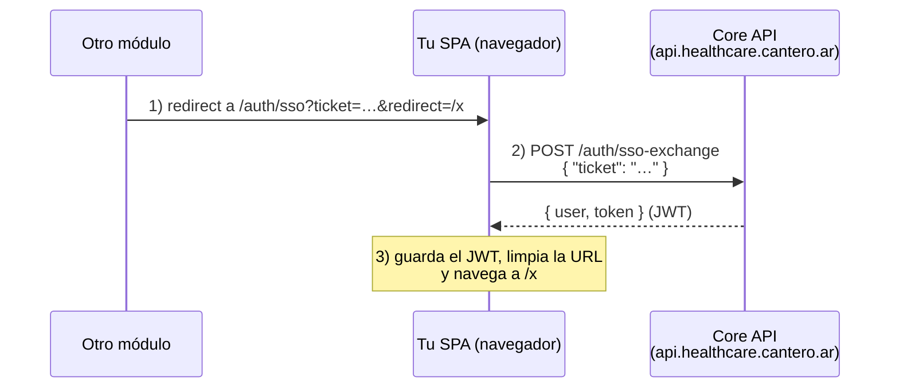

# Guía de integración SSO — para módulos de Health Grid

Esta guía es para los equipos que implementan **otros módulos** de Health Grid y necesitan que un usuario que ya está logueado en otro módulo (o en el core) **llegue ya autenticado** a su aplicación, aunque estén en **dominios distintos** (no comparten cookies).

Sos el **módulo destino**: recibís al usuario por un redirect y tenés que dejarlo logueado en tu app. Esta guía cubre solo tu parte.

> **API del core:** `https://api.healthcare.cantero.ar` — emite y valida los JWT.
> **Ruta de callback del módulo:** `/auth/sso` — el usuario aterriza ahí con el ticket, p. ej.
> `https://healthgrid.cantero.ar/auth/sso?ticket=…`. Cada módulo se sirve en su propio host;
> el path `/auth/sso` es la convención común. Los ejemplos usan `healthgrid.cantero.ar`.

---

## Qué te da el core

- Un **JWT firmado con RS256** (válido 24 h) que identifica al usuario y trae sus permisos.
- La clave pública para validar ese JWT, publicada en
  `https://api.healthcare.cantero.ar/.well-known/jwks.json` (JWKS).
  **No necesitás ninguna clave secreta compartida.**

## Qué tenés que construir

1. Una ruta de **callback** `/auth/sso` que reciba el redirect con un `ticket`.
2. Una llamada al core para canjear ese ticket por un JWT (servidor-a-servidor si tenés
   backend; desde el navegador si sos una SPA — ver [Variante SPA](#variante-módulo-spa-sin-backend-angular--react)).
3. Tu **propia sesión** en tu dominio (cookie / `localStorage`) con ese JWT.
4. **Validación** del JWT en cada request siguiente, usando el JWKS.

---

## El flujo, de tu lado



1. El navegador llega a tu app con una URL tipo:
   `https://healthgrid.cantero.ar/auth/sso?ticket=<opaco>&redirect=/dashboard`
2. Tu backend toma el `ticket` y lo **canjea** contra el core (paso servidor-a-servidor;
   el ticket no se vuelve a exponer al navegador).
3. Recibís `{ user, token }`. Guardás el `token` en tu propia sesión y redirigís al usuario
   a `redirect`.

**Importante:** el `ticket` es de **un solo uso** y **expira en ~60 segundos**. Canjealo apenas lo recibís, desde el backend. No lo guardes ni lo reenvíes al frontend.

---

## Paso a paso

### 1) Endpoint de callback + canje del ticket

`POST https://api.healthcare.cantero.ar/auth/sso-exchange`

Request:

```json
{ "ticket": "9f2c1b7a…e04" }
```

Respuesta `200`:

```json
{
  "user": {
    "id": 42,
    "first_name": "Ana",
    "last_name": "Pérez",
    "email": "ana@example.com"
  },
  "token": "eyJhbGciOiJSUzI1NiIsImtpZCI6Ij…"
}
```

Errores:

| Código | Significado                          | Qué hacer                                                |
| ------ | ------------------------------------ | -------------------------------------------------------- |
| `400`  | Falta el `ticket` en el body         | Revisar tu request                                       |
| `401`  | Ticket inválido, ya usado o expirado | Redirigir al login; el usuario reintenta desde el origen |

### 2) Establecer tu propia sesión

El `token` es el JWT del core. Guardalo **en tu dominio** — el core no maneja tu sesión:

- **Recomendado:** cookie propia `HttpOnly` + `Secure` + `SameSite=Lax`, con el dominio de tu módulo.
- Alternativa (SPA): `localStorage` y mandarlo como `Authorization: Bearer <token>` en tus llamadas.

Ese JWT dura 24 h. Cuando vence, el usuario tiene que volver a pasar por el SSO (o, si tu módulo también habla con el core, podés usar `POST /auth/refresh` mientras siga vigente).

### 3) Validar el JWT en cada request

En cada request protegido de tu módulo, validá el JWT **localmente** contra el JWKS del core. No hace falta llamar al core en cada request.

Endpoint del JWKS: `GET https://api.healthcare.cantero.ar/.well-known/jwks.json`

Pasos:

1. Descargá y **cacheá** el JWKS (respetá rotación de claves vía el `kid` del header del
   token).
2. Verificá la firma con la clave pública correspondiente (**algoritmo RS256, y solo RS256**).
3. Validá `exp` (expiración).
4. Leé los claims de negocio (`user_id`, `permissions`).

Detalle completo y ejemplos en [`JWKS_VALIDATION.md`](JWKS_VALIDATION.md).

---

## Estructura del JWT que vas a recibir

Header:

```json
{ "alg": "RS256", "typ": "JWT", "kid": "a1b2c3d4e5f6a7b8" }
```

Claims (payload):

```json
{
  "user_id": 42,
  "permissions": ["users:read", "locations:read", "…"],
  "iat": 1751846400,
  "exp": 1751932800
}
```

- `user_id` — id del usuario en el core.
- `permissions` — lista plana de permisos (`recurso:accion`). Usala para tu autorización.
- `exp` — expiración (24 h desde la emisión). **Validala siempre.**

> Nota: hoy el token **no** trae `iss`/`aud`. Validá firma + `exp` + los claims de negocio.

---

## Ejemplos de código

### Node.js / Express (canje + validación con JWKS)

```js
import express from "express";
import fetch from "node-fetch";
import { createRemoteJWKSet, jwtVerify } from "jose";

const CORE = "https://api.healthcare.cantero.ar";
const JWKS = createRemoteJWKSet(new URL(`${CORE}/.well-known/jwks.json`)); // cachea solo

const app = express();

// 1) Callback: recibe el ticket y lo canjea
app.get("/auth/sso", async (req, res) => {
  const { ticket, redirect = "/" } = req.query;
  try {
    const r = await fetch(`${CORE}/auth/sso-exchange`, {
      method: "POST",
      headers: { "Content-Type": "application/json" },
      body: JSON.stringify({ ticket }),
    });
    if (!r.ok) return res.redirect("/login");
    const { token } = await r.json();

    // 2) Sesión propia, en tu dominio
    res.cookie("session", token, {
      httpOnly: true,
      secure: true,
      sameSite: "lax",
      maxAge: 24 * 3600 * 1000,
    });
    res.redirect(redirect);
  } catch {
    res.redirect("/login");
  }
});

// 3) Middleware: valida el JWT del core en cada request
async function requireAuth(req, res, next) {
  const token = req.cookies.session;
  if (!token) return res.status(401).json({ error: "no session" });
  try {
    const { payload } = await jwtVerify(token, JWKS, { algorithms: ["RS256"] });
    req.user = { id: payload.user_id, permissions: payload.permissions || [] };
    next();
  } catch {
    res.status(401).json({ error: "invalid token" });
  }
}
```

### Go / Gin (canje del ticket)

```go
// GET /auth/sso?ticket=…&redirect=…
const coreBaseURL = "https://api.healthcare.cantero.ar"

func SSOCallbackHandler(c *gin.Context) {
    ticket := c.Query("ticket")
    redirect := c.DefaultQuery("redirect", "/")

    body, _ := json.Marshal(map[string]string{"ticket": ticket})
    client := &http.Client{Timeout: 5 * time.Second}
    resp, err := client.Post(coreBaseURL+"/auth/sso-exchange",
        "application/json", bytes.NewReader(body))
    if err != nil || resp.StatusCode != http.StatusOK {
        c.Redirect(http.StatusFound, "/login")
        return
    }
    defer resp.Body.Close()

    var out struct{ Token string `json:"token"` }
    json.NewDecoder(resp.Body).Decode(&out)

    // Cookie de sesión en TU dominio.
    c.SetCookie("session", out.Token, 86400, "/", "healthgrid.cantero.ar", true, true)
    c.Redirect(http.StatusFound, redirect)
}
```

Para la validación del JWT en Go, ver el ejemplo con `github.com/MicahParks/keyfunc` en
[`JWKS_VALIDATION.md`](JWKS_VALIDATION.md).

### Prueba rápida con curl

```bash
# Canje del ticket (lo que hace tu backend)
curl -sS -X POST https://api.healthcare.cantero.ar/auth/sso-exchange \
  -H 'Content-Type: application/json' \
  -d '{"ticket":"PEGA_ACA_EL_TICKET"}'
# → { "user": {...}, "token": "eyJ…" }

# El JWKS que usás para validar los JWT
curl -sS https://api.healthcare.cantero.ar/.well-known/jwks.json
```

---

## Variante: módulo SPA sin backend (Angular / React)

Si tu módulo es una **SPA sin backend propio** (Angular, React, etc.), no tenés un
servidor donde hacer el canje back-channel. En ese caso el canje se hace **desde el
navegador**, directo contra el endpoint público `POST /auth/sso-exchange`.

Es un patrón **aceptable** para SPAs porque:

- El `ticket` es de **un solo uso** y expira en **~60 s**: aunque quede un instante en la
  URL, es de bajo valor y no se puede reusar.
- Se canjea **de inmediato** sobre HTTPS por el JWT, que se guarda en tu propio
  almacenamiento (igual que harías tras un login normal).
- Después de canjear, limpiás el `ticket` de la URL (`replaceState` / `replaceUrl`) para que
  no quede en el historial.

> Si tu módulo **sí** tiene backend, preferí el canje servidor-a-servidor de las secciones
> anteriores: el ticket nunca llega a exponerse al navegador.

### El flujo, para una SPA



La ruta de callback es una **ruta del router** de tu SPA (`/auth/sso`), no un endpoint de
servidor. El usuario llega ahí con `?ticket=…&redirect=/ruta-interna`.

### Ejemplo: Angular

Ruta pública en tu `app.routes.ts`:

```ts
{
  path: 'auth/sso',
  loadComponent: () =>
    import('./features/auth/sso/sso.component').then((m) => m.SsoComponent),
},
```

Servicio: canje del código por una sesión (reutiliza tu misma lógica de login):

```ts
// AuthService
establishSessionFromTicket(ticket: string): Observable<SessionUser> {
  return this.http
    .post<ApiAuthResponse>(`${this.baseUrl}/sso-exchange`, { ticket })
    .pipe(
      map((res) => this.persistSession(res)), // guarda el JWT (localStorage/cookie)
      catchError((err) => throwError(() => toError(err))),
    );
}
```

Componente de callback: lee el `ticket`, lo canjea y navega:

```ts
ngOnInit(): void {
  // Acepta el ticket en query (?ticket=) o en fragment (#ticket=), y un redirect interno.
  const snap = this.route.snapshot;
  const frag = snap.fragment ? new URLSearchParams(snap.fragment) : null;
  const ticket = frag?.get('ticket') ?? snap.queryParamMap.get('ticket');
  const redirect = frag?.get('redirect') ?? snap.queryParamMap.get('redirect');

  if (!ticket) {
    this.error.set('El enlace de acceso no incluye un ticket SSO.');
    return;
  }

  this.auth.establishSessionFromTicket(ticket).subscribe({
    next: () => {
      const target = this.safeRedirect(redirect) ?? '/';
      // replaceUrl: el código no queda en el historial de navegación.
      void this.router.navigateByUrl(target, { replaceUrl: true });
    },
    error: (err: Error) => this.error.set(err.message),
  });
}

/** Sólo rutas internas absolutas; descarta URLs externas (open redirect). */
private safeRedirect(path: string | null): string | null {
  if (!path) return null;
  if (!path.startsWith('/') || path.startsWith('//') || path.startsWith('/\\')) return null;
  return path;
}
```

El mismo esquema aplica a React: una ruta `/auth/sso` que, al montarse, lee el `ticket`, hace
el `POST /auth/sso-exchange`, guarda el JWT y hace `navigate(redirect, { replace: true })`.

### Consideraciones de seguridad para SPAs

- **Canjeá apenas montás la ruta** y limpiá el `ticket` de la URL (`replaceUrl` / `replaceState`).
- **Validá el `redirect`**: sólo rutas internas absolutas (`/algo`), nunca URLs externas ni
  `//host` (open redirect).
- El JWT queda en el navegador (localStorage o cookie). Es el mismo modelo de riesgo que tu
  login normal; no lo empeora respecto de lo que ya hacés hoy.
- Serví tu SPA **siempre por HTTPS**.

---

## Checklist de implementación

- [ ] Ruta de callback (`/auth/sso?ticket=…&redirect=…`) en tu módulo.
- [ ] Canje del ticket **desde el backend** si tenés uno (server-to-server); si sos una SPA
      sin backend, canjealo desde el navegador (ver [Variante SPA](#variante-módulo-spa-sin-backend-angular--react)).
- [ ] Canjear **apenas** llega (el ticket expira en ~60 s y es de un solo uso).
- [ ] Guardar el JWT en tu propia sesión (cookie `HttpOnly`+`Secure` recomendado).
- [ ] Validar el `redirect` para evitar **open redirect** (permití solo rutas internas / una
      allowlist).
- [ ] Cachear el JWKS y validar firma **RS256** + `exp` en cada request.
- [ ] Manejar `401` del canje redirigiendo al login.
- [ ] Usar **HTTPS** en tu callback (el JWT viaja en la respuesta del canje).

## Preguntas frecuentes

**¿Necesito una clave secreta del core?**
No. Validás los JWT con la clave **pública** del JWKS. Nada secreto se comparte.

**¿Qué pasa si el ticket expiró o ya se usó?**
El canje devuelve `401`. Mandá al usuario al login; reinicia el flujo desde el módulo origen y obtiene un ticket nuevo.

**¿Puedo canjear el ticket desde el frontend (SPA sin backend)?**
Sí. Si tu módulo es una SPA sin backend (Angular, React, etc.), el canje se hace desde el navegador contra el endpoint público. Es un patrón válido porque el ticket es de un solo uso y de vida corta. Seguí la sección [Variante: módulo SPA sin backend](#variante-módulo-spa-sin-backend-angular--react). Si tenés backend, preferí el canje servidor-a-servidor.

**El JWT vence a las 24 h. ¿Cómo lo renuevo?**
Si tu módulo se comunica con el core, podés usar `POST /auth/refresh` con el token todavía vigente. Si no, el usuario vuelve a pasar por el SSO.

**¿Cómo autorizo acciones?**
Con el claim `permissions` del JWT (formato `recurso:accion`, ej. `users:read`).
