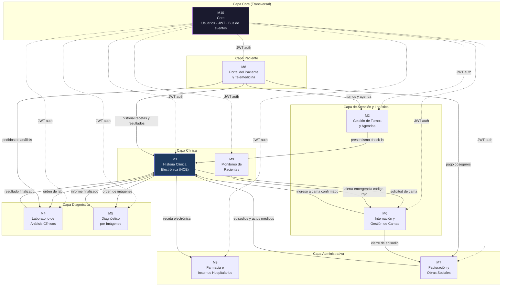
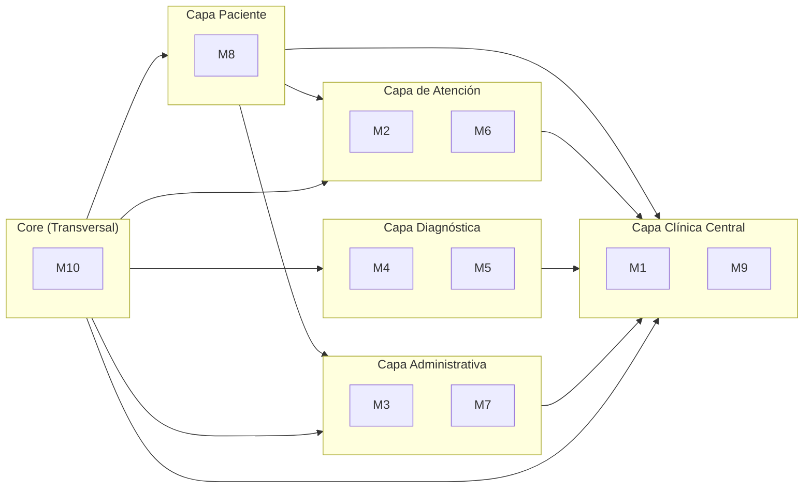

# Arquitectura General — Health Grid (Sistema Completo)

> **Health Grid** · Desarrollo de Aplicaciones II · Ing. Joaquín Timerman
>
> Diagrama de arquitectura integrada de los 10 módulos del sistema.
> Cada grupo debe completar la sección de su módulo con sus contratos reales.
> El objetivo es unificar todo en un único diagrama de referencia.

---

## Estado de integración

| Módulo | Grupo | Arquitectura propia | Contratos compartidos |
|--------|-------|--------------------|-----------------------|
| M1 — HCE | ✅ Nuestro | ✅ Completa | ✅ En este doc |
| M2 — Turnos y Agendas | ⏳ Pendiente | ⏳ | ⏳ |
| M3 — Farmacia e Insumos | ⏳ Pendiente | ⏳ | ⏳ |
| M4 — Laboratorio | ⏳ Pendiente | ⏳ | ⏳ |
| M5 — Diagnóstico por Imágenes | ⏳ Pendiente | ⏳ | ⏳ |
| M6 — Internación y Camas | ⏳ Pendiente | ⏳ | ⏳ |
| M7 — Facturación y Obras Sociales | ⏳ Pendiente | ⏳ | ⏳ |
| M8 — Portal del Paciente | ⏳ Pendiente | ⏳ | ⏳ |
| M9 — Monitoreo de Pacientes | ⏳ Pendiente | ⏳ | ⏳ |
| M10 — Core | ⏳ Pendiente | ⏳ | ⏳ |

---

## Diagrama general — Vista de alto nivel



---

## Diagrama detallado — Flujos de integración

> **Referencias de flechas:**
> - `──►` REST sincrónico
> - `--►` REST webhook / callback asincrónico
> - `══►` Evento Kafka / bus de mensajes
> - `···►` Consulta de lectura (GET)

```mermaid
flowchart TD
    subgraph M10_BOX["M10 — Core  (transversal)"]
        M10_AUTH["Maestro de Usuarios\nControl de Acceso · JWT HS256"]
        M10_BUS["Bus de Eventos\nSuscripciones y reenvío de webhooks"]
        M10_MASTER["Maestro de Sedes\ny Especialidades"]
    end

    subgraph M2_BOX["M2 — Turnos y Agendas"]
        M2_CAL["Calendario Profesional"]
        M2_RESERVA["Reserva de Turnos"]
        M2_PRES["Presentismo / Check-in"]
    end

    subgraph M1_BOX["M1 — Historia Clínica Electrónica  :8000"]
        M1_FICHA["Ficha Médica\nAntecedentes · Alertas"]
        M1_EPISODIO["Episodios de Atención\nEvoluciones Médicas"]
        M1_ORDEN["Órdenes de Estudio\n(Lab + Imágenes)"]
        M1_RECETA["Recetas Electrónicas"]
        M1_SALA["Sala de Espera"]
        M1_INTERN["Internación"]
        M1_RESULT["Resultados\n(Lab + Imágenes)"]
    end

    subgraph M3_BOX["M3 — Farmacia e Insumos"]
        M3_DISP["Dispensación de Recetas"]
        M3_STOCK["Gestión de Inventario"]
    end

    subgraph M4_BOX["M4 — Laboratorio"]
        M4_ORDEN["Gestión de Órdenes"]
        M4_RESULT["Carga de Resultados"]
        M4_RANGO["Validación de Rangos"]
    end

    subgraph M5_BOX["M5 — Diagnóstico por Imágenes"]
        M5_TURNO["Catálogo de Estudios\ny Turnos de equipo"]
        M5_INFORME["Redacción de Informe\n(radiólogo)"]
        M5_VIEWER["Visualizador Lite"]
    end

    subgraph M6_BOX["M6 — Internación y Camas"]
        M6_MAPA["Mapa de Camas"]
        M6_INGRESO["Gestión de Ingresos"]
        M6_PASE["Pases de Piso"]
        M6_CIERRE["Cierre de Episodio"]
    end

    subgraph M7_BOX["M7 — Facturación y Obras Sociales"]
        M7_NOM["Nomenclador Médico"]
        M7_LIQ["Liquidación de Prestaciones"]
        M7_AUD["Auditoría de Cuentas"]
        M7_COSE["Gestión de Coseguros"]
    end

    subgraph M8_BOX["M8 — Portal del Paciente y Telemedicina"]
        M8_SALUD["Mi Salud\nTurnos · Recetas · Resultados"]
        M8_VIDEO["Sala Virtual\nVideollamada"]
        M8_PAGO["Pagos Online\nCoseguros · Particulares"]
        M8_NOTIF["Notificaciones\nen tiempo real"]
    end

    subgraph M9_BOX["M9 — Monitoreo de Pacientes"]
        M9_TELEMETRIA["Ingesta de Telemetría\n(sensores IoT)"]
        M9_MOTOR["Motor de Reglas\nAlertas en tiempo real"]
        M9_PANEL["Panel de Monitoreo\n(enfermería)"]
    end

    %% ── M10 provee autenticación a todos ──────────────────────────
    M10_AUTH -..->|JWT Bearer| M1_BOX
    M10_AUTH -..->|JWT Bearer| M2_BOX
    M10_AUTH -..->|JWT Bearer| M3_BOX
    M10_AUTH -..->|JWT Bearer| M4_BOX
    M10_AUTH -..->|JWT Bearer| M5_BOX
    M10_AUTH -..->|JWT Bearer| M6_BOX
    M10_AUTH -..->|JWT Bearer| M7_BOX
    M10_AUTH -..->|JWT Bearer| M8_BOX
    M10_AUTH -..->|JWT Bearer| M9_BOX

    %% ── M2 → M1 ──────────────────────────────────────────────────
    M2_PRES -->|"POST /webhook/turnos/presentismo\n(check-in paciente)"| M1_SALA

    %% ── M1 → M4 ──────────────────────────────────────────────────
    M1_ORDEN -->|"POST /v1/ordenes\n(nueva orden de lab)"| M4_ORDEN
    M4_RESULT -->|"POST /webhook/laboratorio/resultado\n(resultado finalizado)"| M1_RESULT
    M4_ORDEN -..->|"GET /api/v1/ordenes?tipo=lab\n(sync órdenes pendientes)"| M1_ORDEN

    %% ── M1 → M5 ──────────────────────────────────────────────────
    M1_ORDEN -->|"POST /v1/webhook/orders\n(nueva orden de imágenes)"| M5_TURNO
    M5_INFORME -->|"POST /webhook/imagenes/reporte\n(informe finalizado)"| M1_RESULT
    M5_TURNO -..->|"GET /api/v1/ordenes?tipo=imagen\n(sync órdenes pendientes)"| M1_ORDEN

    %% ── M1 ↔ M6 ──────────────────────────────────────────────────
    M1_INTERN -->|"POST /M6/solicitudes-internacion\n(solicitar cama)"| M6_INGRESO
    M6_INGRESO -->|"POST /api/v1/internacion/ingreso\n(cama asignada)"| M1_INTERN
    M6_CIERRE -->|"evento: episodio cerrado"| M7_LIQ

    %% ── M1 → M3 ──────────────────────────────────────────────────
    M1_RECETA -..->|"GET /api/v1/recetas\n(validar receta para dispensar)"| M3_DISP

    %% ── M7 → M1 ──────────────────────────────────────────────────
    M7_LIQ -..->|"GET /patients/{id}/episodes\n(episodios + actos)"| M1_EPISODIO
    M7_LIQ -..->|"GET /patients/{id}/insurance\n(obra social vigente)"| M1_FICHA

    %% ── M8 → M1 ──────────────────────────────────────────────────
    M8_SALUD -..->|"GET /historial/recetas\n(historial Mi Salud)"| M1_RECETA
    M8_SALUD -..->|"GET /historial/resultados\n(historial Mi Salud)"| M1_RESULT

    %% ── M8 → otros ───────────────────────────────────────────────
    M8_SALUD -..->|turnos del paciente| M2_RESERVA
    M8_SALUD -..->|pedidos de análisis| M4_ORDEN
    M8_PAGO -->|pago de coseguros| M7_COSE

    %% ── M9 → M6 ──────────────────────────────────────────────────
    M9_MOTOR -->|"evento: alerta emergencia\n(código rojo)"| M6_MAPA

    %% ── M10 bus de eventos ────────────────────────────────────────
    M10_BUS -..->|reenvía laboratorio.resultado_listo| M1_RESULT
    M10_BUS -..->|reenvía imagenes.reporte_finalizado| M1_RESULT
    M10_BUS -..->|reenvía turnos.presentismo| M1_SALA

    %% ── M1 → M10 ─────────────────────────────────────────────────
    M1_BOX -->|"POST /events/subscriptions\n(suscripción en startup)"| M10_BUS

    style M1_BOX fill:#1e3a5f,stroke:#6366f1,color:#e2e8f0
    style M10_BOX fill:#1a1a2e,stroke:#a855f7,color:#e2e8f0
    style M2_BOX fill:#1a2e1a,stroke:#22c55e,color:#e2e8f0
    style M3_BOX fill:#2e1a1a,stroke:#ef4444,color:#e2e8f0
    style M4_BOX fill:#1a2a2e,stroke:#06b6d4,color:#e2e8f0
    style M5_BOX fill:#1a2a2e,stroke:#0ea5e9,color:#e2e8f0
    style M6_BOX fill:#2e2a1a,stroke:#f59e0b,color:#e2e8f0
    style M7_BOX fill:#2e1a2e,stroke:#d946ef,color:#e2e8f0
    style M8_BOX fill:#1a1e2e,stroke:#818cf8,color:#e2e8f0
    style M9_BOX fill:#2e1a1e,stroke:#f43f5e,color:#e2e8f0
```



---

## Mapa de integraciones conocidas (tabla completa)

> Estado de cada integración según la información disponible al momento.
> Las celdas con `?` deben ser completadas por el grupo correspondiente.

| # | Origen | Destino | Endpoint / Topic | Tipo | Confirmado por |
|---|--------|---------|-----------------|------|----------------|
| 1 | M2 | M1 | `POST /api/v1/webhook/turnos/presentismo` | REST webhook | M1 ✅ |
| 2 | M2 | M1 | Topic `clinica.turnos.presentismo` | Kafka | M1 ✅ |
| 3 | M1 | M4 | `POST {M4}/v1/ordenes` | REST sync | M1 ✅ |
| 4 | M4 | M1 | `POST /api/v1/webhook/laboratorio/resultado` | REST webhook | M1 ✅ |
| 5 | M4 | M1 | `GET /api/v1/ordenes?tipo_estudio=Laboratorio` | REST GET | M1 ✅ |
| 6 | M4 | M1 | `GET /api/v1/ordenes/{id}` | REST GET | M1 ✅ |
| 7 | M1 | M5 | `POST {M5}/v1/webhook/orders` | REST sync | M1 ✅ |
| 8 | M5 | M1 | `POST /api/v1/webhook/imagenes/reporte` | REST webhook | M1 ✅ |
| 9 | M5 | M1 | `GET /api/v1/ordenes?tipo_estudio=Imagen` | REST GET | M1 ✅ |
| 10 | M1 | M6 | `POST {M6}/api/M6/solicitudes-internacion` | REST sync | M1 ✅ |
| 11 | M6 | M1 | `POST /api/v1/internacion/ingreso` | REST webhook | M1 ✅ |
| 12 | M7 | M1 | `GET /api/v1/patients/{id}/episodes` | REST GET | M1 ✅ |
| 13 | M7 | M1 | `GET /api/v1/patients/{id}/episodes/{id}/medical-acts` | REST GET | M1 ✅ |
| 14 | M7 | M1 | `GET /api/v1/patients/{id}/insurance` | REST GET | M1 ✅ |
| 15 | M8 | M1 | `GET /api/v1/pacientes/{id}/historial/recetas` | REST GET | M1 ✅ |
| 16 | M8 | M1 | `GET /api/v1/pacientes/{id}/historial/resultados` | REST GET | M1 ✅ |
| 17 | M3 | M1 | `GET /api/v1/recetas` | REST GET | M1 ✅ (inferido) |
| 18 | M9 | M6 | evento: alerta emergencia código rojo | Async/Event | Consigna |
| 19 | M6 | M7 | evento: cierre de episodio | Async/Event | Consigna |
| 20 | M8 | M2 | ? | ? | Pendiente M2 |
| 21 | M8 | M4 | ? | ? | Pendiente M4 |
| 22 | M8 | M7 | ? | ? | Pendiente M7 |
| 23 | M2 | M8 | evento: recordatorio turno (24hs antes) | Async/Event | Consigna |
| 24 | M1 | M10 | `POST {Core}/events/subscriptions` | REST sync | M1 ✅ |
| 25 | M10 | M1 | `GET /api/v1/hce/health` | REST GET | M1 ✅ |
| 26 | M10 | todos | JWT Bearer | Auth | M1 ✅ |

---

## Arquitectura por capa



---

## Sección por módulo — Completar con la info de cada grupo

> Cada grupo debe completar su sección con: puerto, base URL, endpoints expuestos y llamadas salientes.

### M2 — Gestión de Turnos y Agendas

```
Puerto:        ? (ej: 8002)
Base URL:      ?
Tecnología:    ?

Endpoints expuestos (entrada):
  ?

Llamadas salientes (salida):
  → M1: POST /api/v1/webhook/turnos/presentismo

Eventos Kafka:
  Publica: clinica.turnos.presentismo
  Consume: ?
```

### M3 — Farmacia e Insumos Hospitalarios

```
Puerto:        ?
Base URL:      ?
Tecnología:    ?

Endpoints expuestos (entrada):
  ?

Llamadas salientes (salida):
  → M1: GET /api/v1/recetas (validar receta antes de dispensar)

Eventos Kafka:
  ?
```

### M4 — Laboratorio de Análisis Clínicos

```
Puerto:        8004 (confirmado por M1)
Base URL:      http://localhost:8004/api
Tecnología:    ?

Endpoints expuestos (entrada — confirmados por M1):
  POST /v1/ordenes           (recibe nueva orden de M1)
  GET  /v1/estudios          (catálogo de estudios)
  GET  /v1/ordenes           (listado de órdenes)

Llamadas salientes (salida — confirmadas por M1):
  → M1: POST /api/v1/webhook/laboratorio/resultado
  → M1: GET  /api/v1/ordenes?tipo_estudio=Laboratorio  (sync)

Eventos Kafka:
  Publica: laboratorio.resultado_listo
```

### M5 — Diagnóstico por Imágenes

```
Puerto:        ? (producción: uade-da2-backend.onrender.com)
Base URL:      https://uade-da2-backend.onrender.com
Tecnología:    ?

Endpoints expuestos (entrada — confirmados por M1):
  POST /v1/webhook/orders              (recibe nueva orden de imagen)
  GET  /v1/webhook/reportById          (detalle de reporte finalizado)
  GET  /v1/webhook/images/{reportId}   (imágenes del reporte)

Llamadas salientes (salida — confirmadas por M1):
  → M1: POST /api/v1/webhook/imagenes/reporte
  → M1: GET  /api/v1/ordenes?tipo_estudio=Imagen  (sync)

Eventos Kafka:
  Publica: imagenes.reporte_finalizado
```

### M6 — Internación y Gestión de Camas

```
Puerto:        8006 (confirmado por M1)
Base URL:      http://localhost:8006/api
Tecnología:    ?

Endpoints expuestos (entrada — confirmados por M1):
  POST /M6/solicitudes-internacion     (recibe solicitud de cama de M1)

Llamadas salientes (salida — confirmadas por M1):
  → M1: POST /api/v1/internacion/ingreso   (confirma ingreso a cama)

Eventos Kafka / Async:
  Publica: evento cierre de episodio → M7
  Consume: alerta emergencia de M9
```

### M7 — Facturación y Obras Sociales

```
Puerto:        ?
Base URL:      ?
Tecnología:    ?

Endpoints expuestos (entrada):
  ?

Llamadas salientes (salida — confirmadas por M1):
  → M1: GET /api/v1/patients/{id}/episodes
  → M1: GET /api/v1/patients/{id}/episodes/{id}/medical-acts
  → M1: GET /api/v1/patients/{id}/insurance

Eventos Kafka:
  Consume: evento cierre de episodio de M6
```

### M8 — Portal del Paciente y Telemedicina

```
Puerto:        ?
Base URL:      ?
Tecnología:    ?

Endpoints expuestos (entrada):
  ?

Llamadas salientes (salida — confirmadas por M1):
  → M1: GET /api/v1/pacientes/{id}/historial/recetas
  → M1: GET /api/v1/pacientes/{id}/historial/resultados
  → M2: ? (turnos del paciente)
  → M4: ? (pedidos de análisis)
  → M7: ? (pago coseguros)
```

### M9 — Monitoreo de Pacientes

```
Puerto:        ?
Base URL:      ?
Tecnología:    ?

Endpoints expuestos (entrada):
  ?

Llamadas salientes / Eventos:
  → M6: evento alerta emergencia código rojo (async)

Fuente de datos:
  Dispositivos IoT / sensores (simulados via cola de mensajes)
```

### M10 — Core

```
Puerto:        8010 (confirmado por M1)
Base URL:      http://localhost:8010/api/v1
Tecnología:    ?

Endpoints expuestos (entrada — confirmados por M1):
  GET  /events/types           (tipos de eventos registrados)
  POST /events/subscriptions   (registro de suscripciones de webhooks)
  POST /auth/login             (emisión de JWT)

Llamadas salientes (salida):
  → Todos los módulos: reenvío de eventos a webhooks suscriptos

Auth:
  Emite JWT firmados HS256 con clave compartida
  Clave compartida con M1: "super-secret-key-compartida-con-core"
```

---

## Cómo completar este documento

Cuando cada grupo tenga su arquitectura documentada, completar su sección con:

```
Puerto:        [puerto real]
Base URL:      [URL base del módulo]
Tecnología:    [framework y lenguaje]

Endpoints expuestos (entrada):
  [MÉTODO] [path]  →  [descripción]

Llamadas salientes (salida):
  → [Módulo destino]: [MÉTODO] [path del destino]

Eventos Kafka:
  Publica: [topic] → [módulo destino]
  Consume: [topic] ← [módulo origen]
```

Luego actualizamos la tabla de la sección **"Mapa de integraciones conocidas"** y el **diagrama detallado** con los nuevos contratos.

---

*Health Grid — Arquitectura General · Última actualización: M1 HCE*
